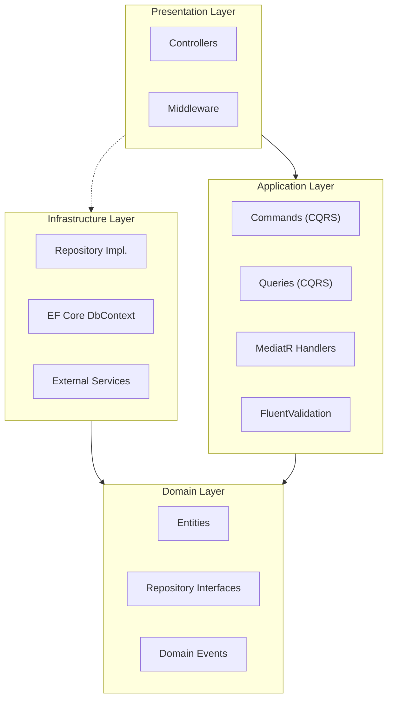

# .NET Core Clean Architecture API

[](https://dotnet.microsoft.com/)
[](https://docs.microsoft.com/en-us/dotnet/csharp/)
[](https://docs.microsoft.com/en-us/ef/core/)
[](https://jwt.io/)
[](LICENSE)

> A production-ready **.NET Core 8 REST API** built with **Clean Architecture**, **CQRS** pattern, and domain-driven design principles. This template reflects real enterprise patterns used in large-scale retail and finance systems.

---

## Architecture Overview



---

## Project Structure

```
CleanArchitectureApi/
├── src/
│   ├── Domain/                          # Core business logic
│   │   ├── Entities/
│   │   ├── ValueObjects/
│   │   ├── Events/
│   │   └── Interfaces/
│   │       ├── IRepository.cs
│   │       └── IUnitOfWork.cs
│   ├── Application/                     # Use cases, CQRS
│   │   ├── Features/
│   │   │   ├── Users/
│   │   │   │   ├── Commands/CreateUserCommand.cs
│   │   │   │   └── Queries/GetUserQuery.cs
│   │   ├── DTOs/
│   │   ├── Validators/
│   │   └── DependencyInjection.cs
│   ├── Infrastructure/                  # DB, external services
│   │   ├── Persistence/AppDbContext.cs
│   │   ├── Repositories/
│   │   ├── Services/
│   │   └── DependencyInjection.cs
│   └── API/                             # Entry point
│       ├── Controllers/
│       ├── Middleware/
│       └── Program.cs
└── tests/
    ├── Domain.Tests/
    └── Application.Tests/
```

---

## Tech Stack

| Layer | Technology | Purpose |
|-------|-----------|---------|
| **Framework** | ASP.NET Core 8 | HTTP pipeline, DI, Routing |
| **CQRS** | MediatR 12 | Command/Query separation |
| **ORM** | Entity Framework Core 8 | Data access abstraction |
| **Validation** | FluentValidation | Request validation pipeline |
| **Auth** | JWT + Refresh Tokens | Stateless authentication |
| **Mapping** | AutoMapper | DTO to Entity mapping |
| **Docs** | Swagger / OpenAPI | API documentation |
| **Testing** | xUnit + Moq | Unit and integration tests |

---

## Getting Started

```bash
git clone https://github.com/asad4230/dotnet-clean-architecture-api.git
cd dotnet-clean-architecture-api
dotnet restore
dotnet ef database update --project src/Infrastructure --startup-project src/API
dotnet run --project src/API
```

Navigate to `https://localhost:5001/swagger` for the interactive Swagger UI.

---

## API Endpoints

### Auth
| Method | Endpoint | Description |
|--------|----------|-------------|
| POST | /api/auth/register | Register new user |
| POST | /api/auth/login | Login and get JWT |
| POST | /api/auth/refresh | Refresh access token |

### Users
| Method | Endpoint | Description |
|--------|----------|-------------|
| GET | /api/users | Get all users (paginated) |
| GET | /api/users/{id} | Get user by ID |
| PUT | /api/users/{id} | Update user |
| DELETE | /api/users/{id} | Delete user |

---

## Layer Responsibilities

| Layer | Responsibility | Key Libraries |
|-------|---------------|---------------|
| **Domain** | Business rules, entities, no external dependencies | Pure C# |
| **Application** | Use cases, CQRS, orchestration | MediatR, FluentValidation |
| **Infrastructure** | DB, external services, file system | EF Core, Dapper, AWS SDK |
| **API** | HTTP, routing, auth, serialization | ASP.NET Core, JWT, Swagger |

---

## Real-World Context

This pattern was applied in a **retail platform** serving 145+ branches with:
- Multi-tenant support per branch
- Role-based access control (Admin, Manager, Cashier)
- High-throughput transaction processing
- Centralized reporting across all branches

---

Built by [Asad Mushtaq](https://github.com/asad4230) · Solution Architect & Tech Lead · 11+ Years
